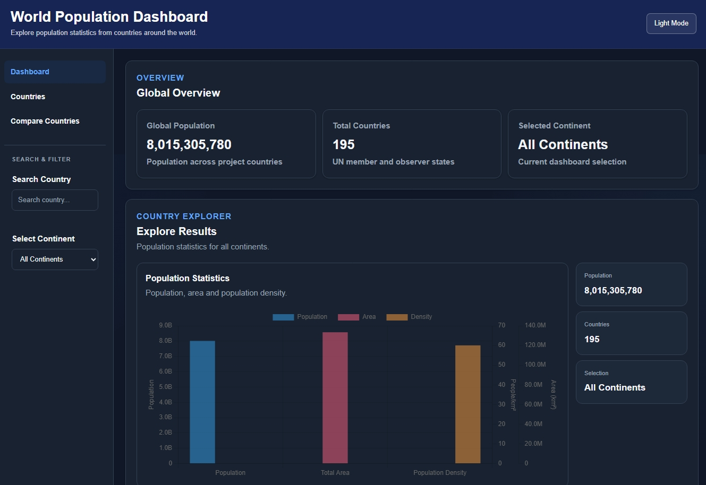
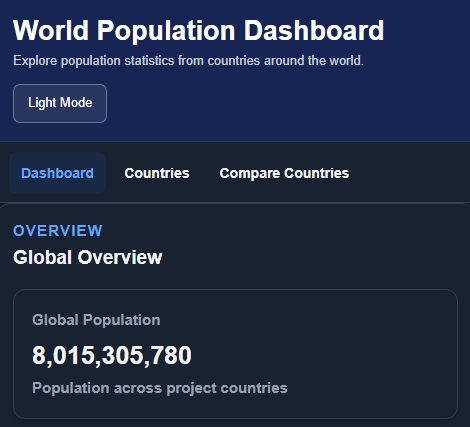
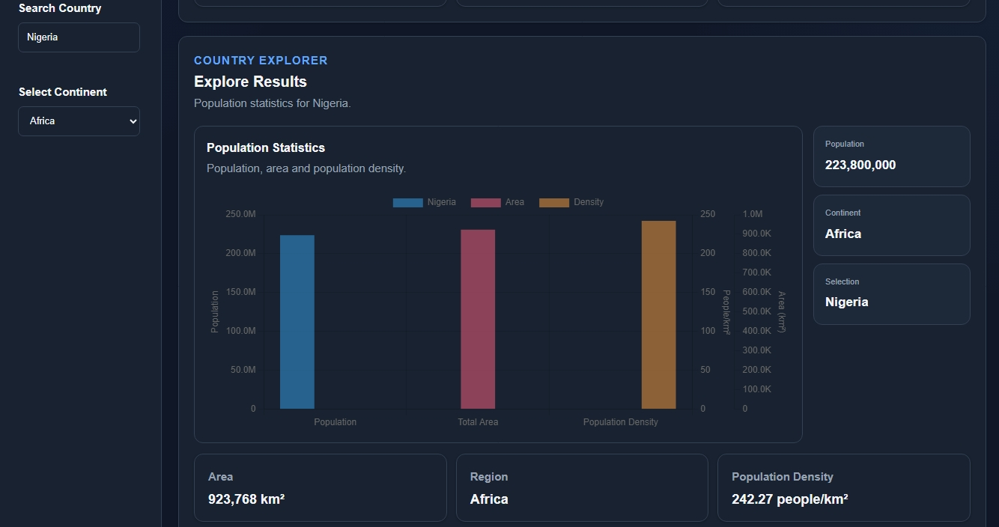
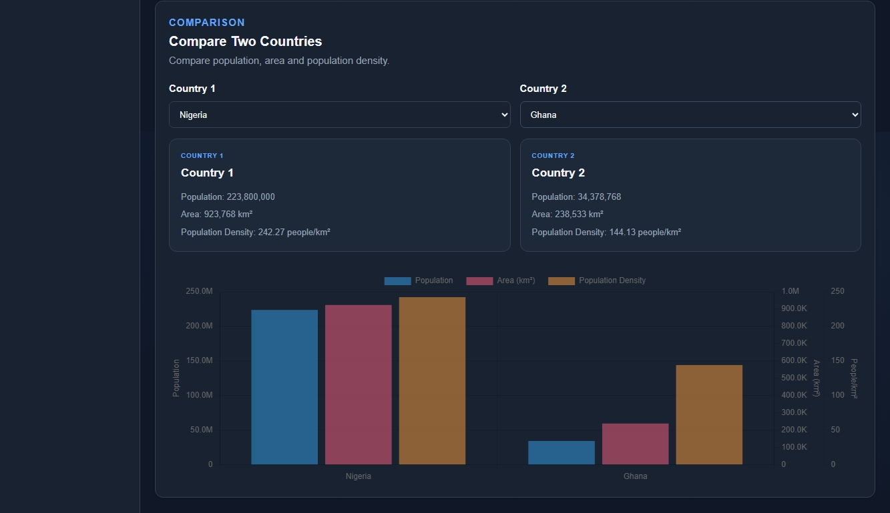

# World Population Dashboard - Group Three

A web-based World Population Dashboard developed by Group Three as a Software Engineering project.

The dashboard provides population information for countries around the world and presents the information through search, filters, rankings, charts and country comparison features.

## Project Overview

The World Population Dashboard was developed to make country population information easier to search, compare and understand from one place.

Users can search for a country, filter countries by continent, view population rankings, compare two countries and view population information using interactive charts.

## Screenshots

### Desktop Dashboard



### Mobile Dashboard



## Main Features

### Global Overview

The dashboard provides a quick summary of:

- Global Population
- Total Countries
- Selected Continent

The population and country values are calculated from the project dataset and are not manually entered.

### Country Search

Users can search for a country from the search field.

As the user types, matching country names are suggested.

The result is displayed after the user presses Enter.

If the country cannot be found, an error message is displayed.

When a country is found, its continent is automatically identified.



### Continent Filter

Users can filter the Explore Results by:

- All Continents
- Africa
- Asia
- Europe
- North America
- South America
- Oceania

The Explore section displays information based on the selected country or continent.

### Explore Results

The Explore section displays:

- Population
- Number of Countries
- Selection
- Area
- Region
- Population Density

The section also contains an interactive Chart.js visualization for population, area and population density.

### Population Rankings

The dashboard displays:

- Top 10 Most Populous Countries
- Top 10 Least Populous Countries

The ranking section has its own continent filter.

Changing the ranking filter does not change the Explore Results.

### Population by Region

A Chart.js bar chart displays the total population grouped by geographic region.

### Country Comparison

Users can select two countries and compare:

- Population
- Area
- Population Density

A comparison chart is also displayed for the selected countries.



### Responsive Design

The dashboard is designed to work on:

- Desktop
- Tablet
- Mobile

The layout changes on smaller screens so that the dashboard sections, controls and comparison cards can fit different screen sizes.

### Dark Mode

The dashboard includes a light and dark theme.

The selected theme is saved in the browser so that it can be maintained when the page is revisited.

### Animated Statistics

Population and country numbers have a counting animation when new values are displayed.

Charts also use animation when they are created or updated.

## Technologies Used

- HTML5
- CSS3
- JavaScript
- REST Countries API
- Chart.js
- localStorage

## API

The project uses the REST Countries API v5.

API endpoint:

https://api.restcountries.com/countries/v5


## Data Caching

The dashboard stores the country data temporarily in the browser using localStorage.

The cached data is used for 24 hours. During this period, normal page refreshes and dashboard interactions use the cached data instead of repeatedly requesting the same information from the API.

After 24 hours, the dashboard requests fresh data from the API and updates the stored data.

## Project Structure

```text
world-population-dashboard-group-three/
│
├── index.html
├── README.md
│
├── screenshots/
│   ├── desktop.jpeg
│   ├── mobile.jpeg
│   ├── country-search.jpeg
│   └── country-comparison.jpeg
│
├── css/
│   └── style.css
│
└── js/
    └── script.js
